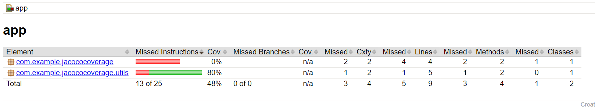

# JacocoCoverage

Projeto de exemplo para demonstrar a utilização do Jacoco para geração de relatórios de cobertura de código
com unit tests

## Requisitos
Antes de executar a aplicação, certifique-se de ter instalado em sua máquina as seguintes tecnologias:

- Java Development Kit (JDK) versão 17 ou superior.
- Android Studio Giraffe | 2022.3.1 Patch 3

## Configuração
Para instalação das dependências rodar o seguinte comando:
`./gradlew clean build`

Para compilar o projeto debug:
`./gradlew clean assembleDebug`

Para executar o checkStyle:
`./gradlew checkstyle`

Executar os testes unitários
`./gradlew clean test -d`

Para verificar a coverage do jacoco, verificar o coverage em 'build/reports/jacoco/debugCoverage/html/index.html':
`./gradlew clean jacocoAllCoverage -d`
`./gradlew clean jacocoTestReport -d`

### Reference Documentation
Para mais referências, favor considerar as sessões abaixo:

* [Official Gradle documentation](https://docs.gradle.org/current/userguide/userguide.html)
* [Gradle User Manual](https://docs.gradle.org/current/userguide/userguide.html)
* [Building Java Applications](https://docs.gradle.org/current/userguide/building_java_projects.html)
* [Gradle Java Plugin](https://docs.gradle.org/current/userguide/java_plugin.html)